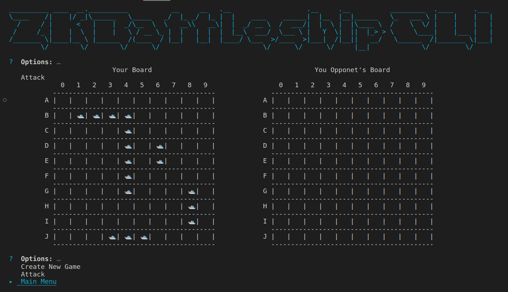

# ZK Battleship Game on Solana

## Basic Game Description
---

### Game Definition:

- [Battleships](https://en.wikipedia.org/wiki/Battleship_(game)) (also known as **Sea Battle**) is a strategy-type guessing game for two players.
- It is played on ruled grids (paper or board) on which each player's fleet of warships is marked.
- The locations of the fleets are **concealed** from the other player.
- Players alternate turns calling "shots" at the other player's ships, and the objective of the game is to destroy the opposing player's fleet.

    
- The paper/board game is played on four grids, two for each player.
- The grids are typically square – usually **10×10** – and the individual squares in the grid are identified by letter and number.
- On one grid the player arranges ships and records the shots by the opponent. On the other grid, the player records their own shots.


### Motivation:
- A fundamental element of the game is that it involves “trust” between the players.
- The game assumes that each player honestly announces if the shot has successfully hit his/her own ship.
- Given that the game is traditionally held physically between two players, they can reconcile each other’s “shot” records at the end of the game, so it is not too bad.
- However, if the game is held remotely (e.g. internet), the assumption of trust would not work well, especially if the players want to bet money on a win.
- When building a Battleship game as a **web application**, the obvious implementation is that the actual ship deployment is stored in the web server, and the verification of whether the ships get hit or not is also performed by the web server, which is indeed centralized and trusted by all players 😟.

### Solution:
- Moving the implementation to be decentralized as a peer-to-peer game (or Dapp) is a noteworthy solution to involve money in games as well as eliminating trust between players or any other centralized authority.
- zkSNARKs proof enables solid verification without revealing enemies' battleship deployment.
- Doing everything on-chain is too transparent, therefore there should be a way to persist ship deployment locally with the player’s machine, whilst being able to prove to the opponent whether his/her shots successfully hit the ships or not.
        
    ⇒ With the ability to generate zero-knowledge proof locally and verify the results on a blockchain network (e.g. Ethereum, Solana), players do not have to trust each other and expose their ship deployment data (secret) online at all. The on-chain verifier can do the job fairly for them.

    ⇒ The ZK Battleship game is based on zero-knowledge proofs and poseidon encryption to keep the game state completely trustless and private to the players.
    
    <br>


## Technical Description
---
→ Regarding that every move made in the game i.e. transaction is public, the game progression stats is masked applying [poseidon encryption]((https://github.com/weijiekoh/poseidon-encryption-circom)) to the game results. 
- The encryption and decryption of the game data requires a common shared key generated by both players as well as a 128-bit random nonce.
- Each player generates a random private key and shares his/her public key with the account whenever he/her joins or hosts a game. Before making any move, the player retrieves the opponent's public key from the account and generates an ECDH shared key to encrypt or decrypt the data.


→ The boards and shots of the players are kept private utilizing the DSL circom2 to develop the circuits required to integerate the ZKP logic to the solana program.

→ The ZK impelemenation of the game is based on two main circuits. 

→ The first circuit is the [board circuit](./circuits/board.circom), it takes the board of the player as a private input and its poseidon hash as a public input that serves as integrity attestation that the player's board is not tampered with. 
- When a player hosts or joins a game, the initial board hash of the player is saved in the game account so that the program conducts the [groth16 verification](https://crates.io/crates/groth16-solana) of the proof + the stored hash as public input. Hence, any interference with the board even as a private input is reverted by the program due to non compliant board hash.

- This is where the magic of zero knowledge and privacy prevails handy. It shows that it is possible to trustlessly enable provable integration of hidden information into the game by using these inputs initially saved in the game account. The board hashes saved from the initilization of the game will still be used to prove the integrity of the players' boards whenever an attack(shot) is made.

→ The second circuit is the [shot circuit](./circuits/shot.circom). 
- The circuit operates on the encrypted shot coordinates of each player's opponent that is saved in the account corresponding to the previous turn.
- Public Inputs: the board hash, the random nonce, and the encrypted shot that are saved in the account from the previous turn.
- Private Inputs: the player's board, the shared key, and the hit result.
- The circuit decrypts the ciphertext, checks the range validity of the shot. It also hashes the board which is a private input and makes a hash integrity check according to the board hash that is a public input inserted from the game account. Finally, it scans the shot for hit or miss (1 or 0) and asserts the result to the hit private input for compliance check.
- Note: the hit private input is the result of the plaintext shot scan from a ts function so that the circuit doesn't have an output because an output of a circom circuit is always public and therefore reveals the game progression data.

→ To keep the game account data storage as efficient as possible, the account stores only one encrypted shot and one encrypted hit result at a time, this way, when a player makes a move, the program verifies the shot circuit according to the encrypted shot from the previous turn (opponent's shot) and if successful, it updates the shot as the current player's encrypted shot in order to be verified in the next turn.

→ It is unavoidable that each player knows his/her shot result only when the opponent's finishes playing his/her turn because private inputs of the shot circuit can only be entered by the player himself/herself.

→ It is notable that the game stat progression for each player is synchronously retrieved, decrypted, and saved by the client and hence the whole game data of the player and his opponents is displayed clear and complete without any issue and with a minimum data exchange through the game account.

⇒ The ZK Battleship game cli is still under development, however it shows a cool interface for a user to host or join a game with everything clearly displayed without any worries of the technical or cryptographic operations. 




## Steps (requires Linux/ OS X)
Since compatibility is a common question, M1 chips will outperform the expected wait times on ptau and setup
Node v16.17.1 was last used to compile this project, and failure to use it will break ipfs in deploy script (either use node 16 or comment out IPFS)

### 0. [Ensure Circom 2.x.x is installed locally](https://github.com/iden3/circom/blob/master/mkdocs/docs/getting-started/installation.md)
```
curl --proto '=https' --tlsv1.2 https://sh.rustup.rs -sSf | sh
git clone https://github.com/iden3/circom.git
cd circom
cargo build --release
cargo install --path circom
cd ..
```
### 1. Install the neccessary dependencies
```
yarn install
```
### 2. Run POT15 ceremony 
```
yarn ptau
```
### 3. Build zkeys and verification keys for each circuit
```
yarn setup
```

### 4. Build, Deploy & Test

`anchor build` to build the solana program.

`anchor deploy` to deploy the game to localnet.

`anchor test --skip-deploy --skip-local-validator` to test the game.

### 5. Clean Circuit Artifacts

`yarn clean-artifacts` to clean all circuit artifacts.

`yarn clean-setup` to clean circuit setup excluding ptau files.

## 6. Acknowledgements

- Shoutout to [BattleZips](https://github.com/BattleZips/BattleZips/tree/master) folks for their meticulous work in integrating the ZK logic to smart contracts and their detailed documentation for their code.

- Great appreciation to [weijiekoh](https://github.com/weijiekoh/poseidon-encryption-circom) for the poseidon encryption circuits and his contribution to many useful cryptography libraries.

- Also great appreciation to [no-stack-dub-sack](https://github.com/no-stack-dub-sack/battleship-cli) for the inspiring and cool cli that helped developing the cli of this project despite being still under development.

- All gratitude especially to [ananas-block](https://crates.io/crates/groth16-solana) for the groth16 solana verifier that without it, this project wouldn't be implementing ZK logic to the program. In addition to his support and guidance during the six months of my short career.


